# Monopoly-Game
A replica of the Monopoly game created by me and my friend for our grade 12 computer science course. This was our final project.

## Features:
- 2-4 players
- Buying and mortgaging of properties
- Chance and Community cards
- Jail
- Dice
- Display for players information
- Seperate window for the information of a given property and the players list of properties
- Ability to pay and collect rent
- Green indicator on current player

## Images:

#### Menu:

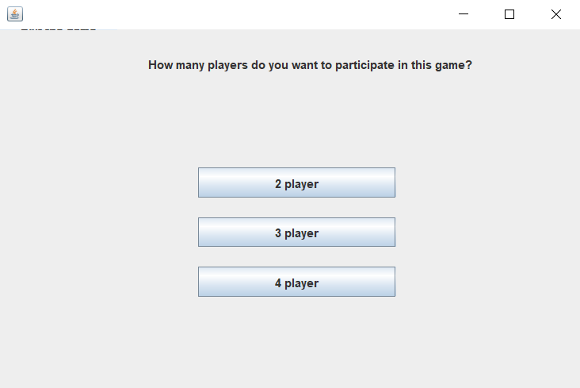

#### 2 Players Start:

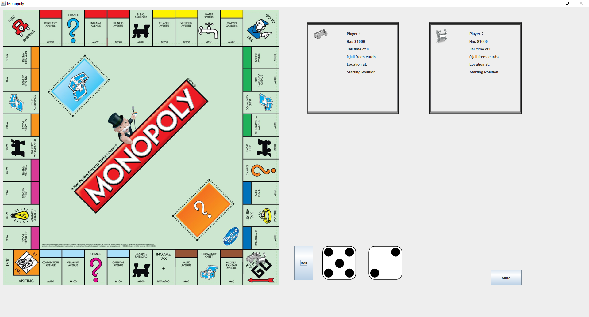

#### 3 Players Start:

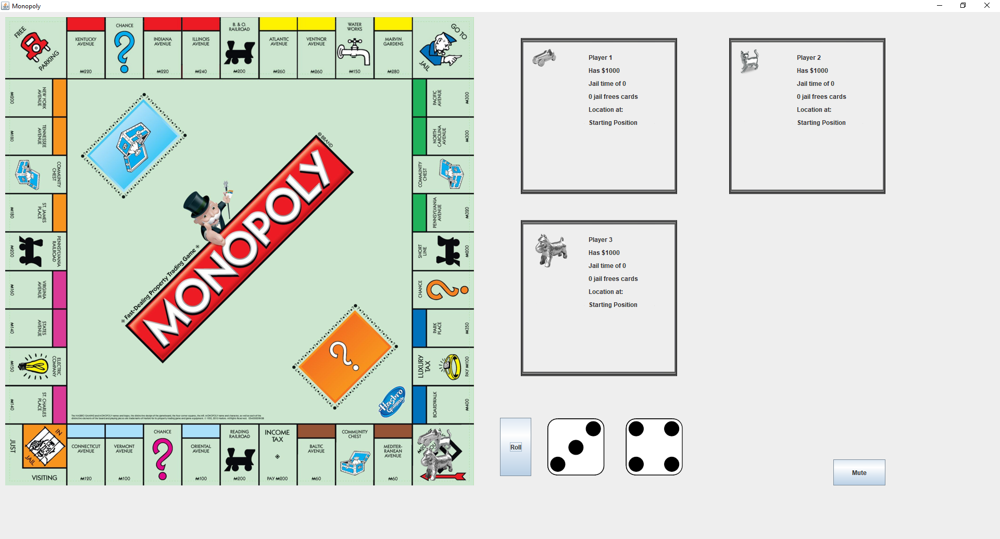

#### 4 Players Start:

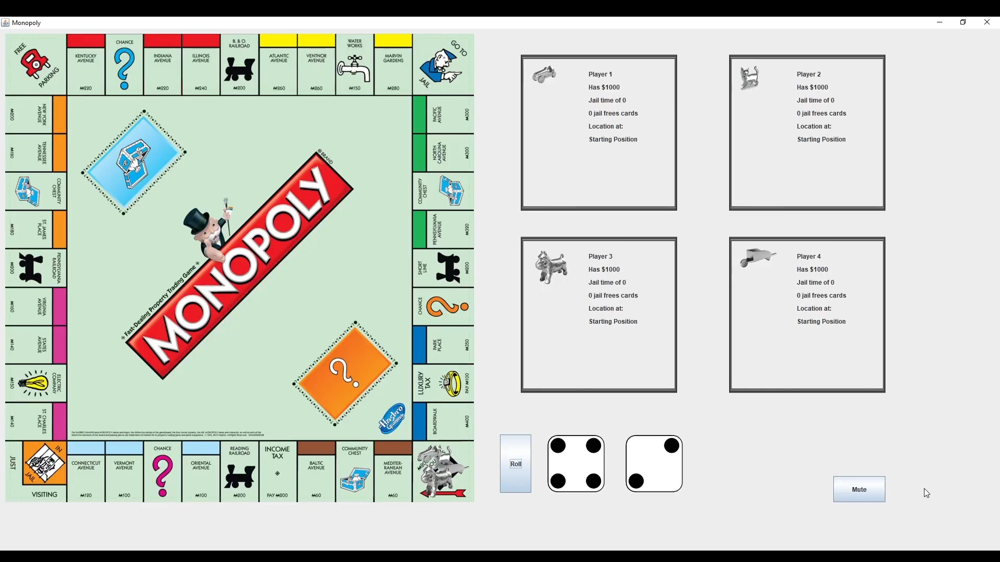

#### List of no Properties:

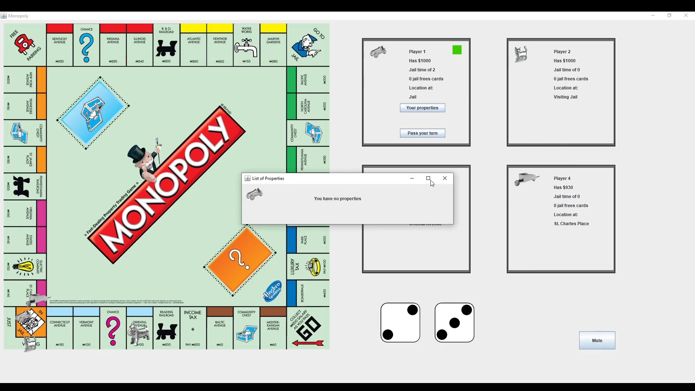

#### Chance Cards:

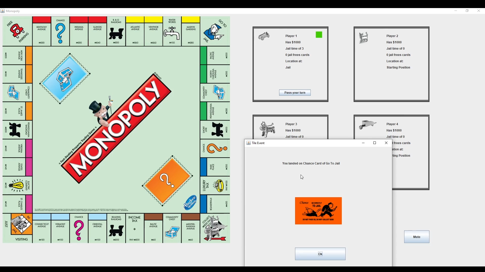

#### Community Card:

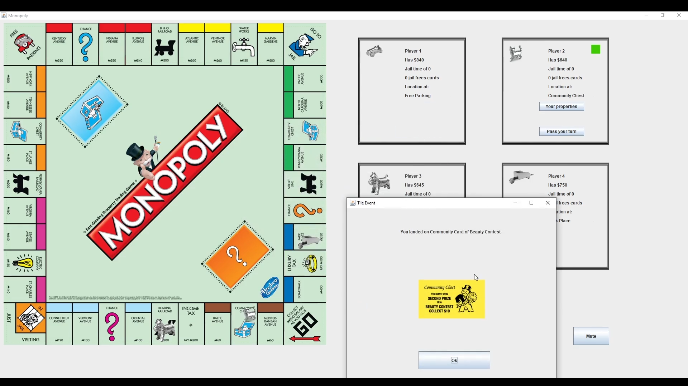

#### Rolling 3 doubles leads to Jail:

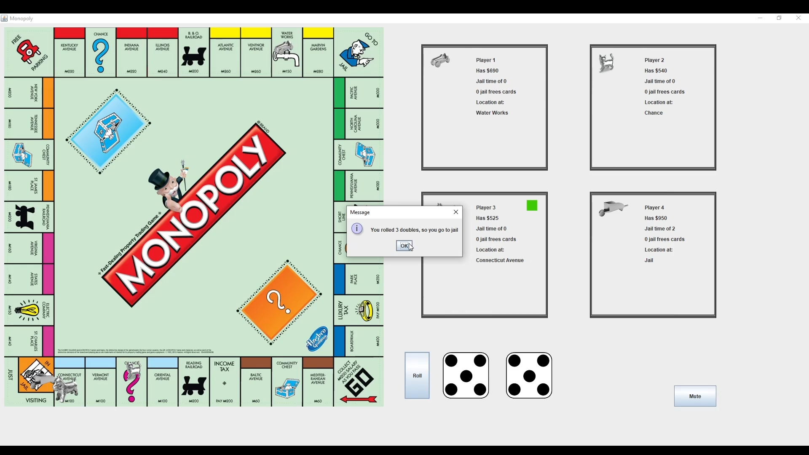

#### Activities in Jail:

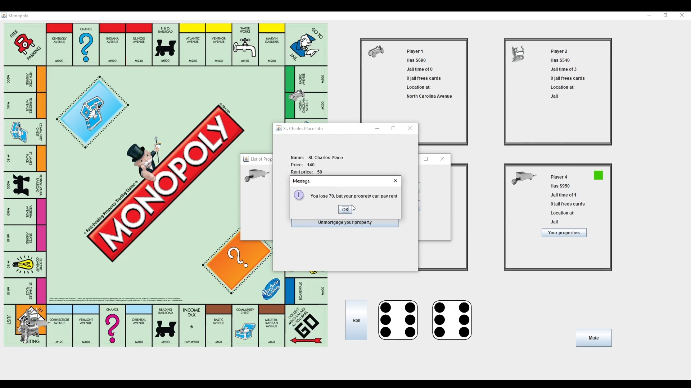

#### Buying a Property:

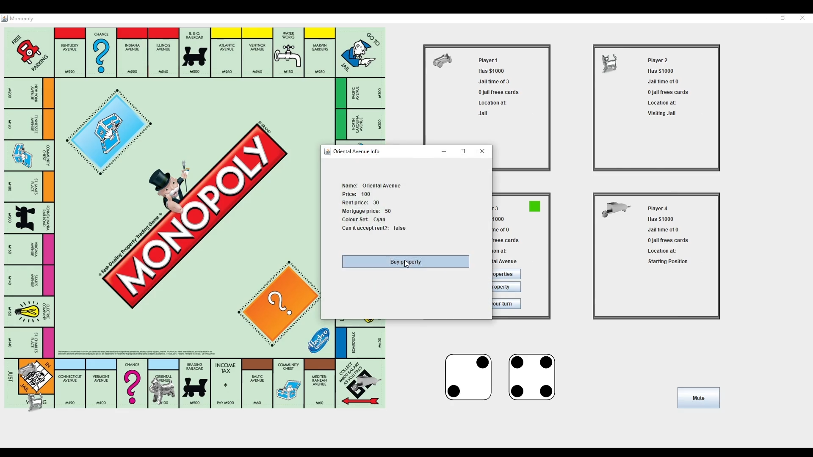

#### Mortgaging a Property:

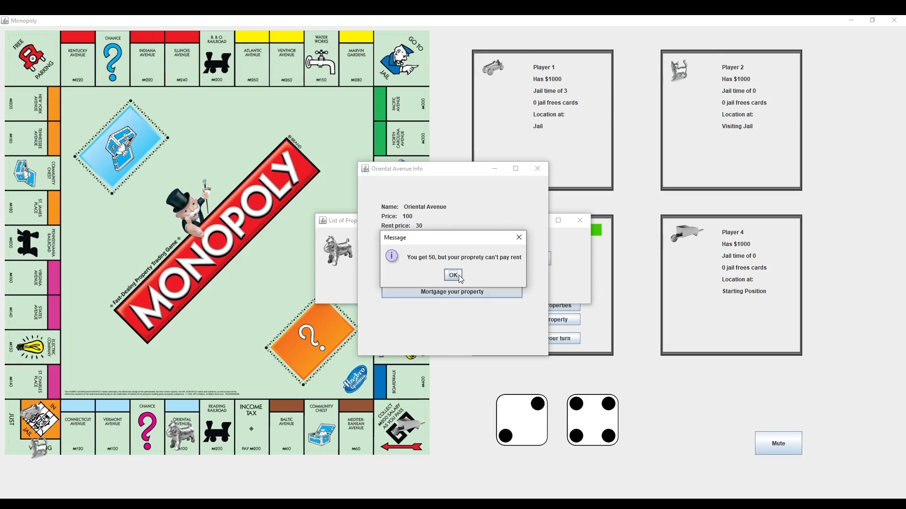

#### Paying Rent:

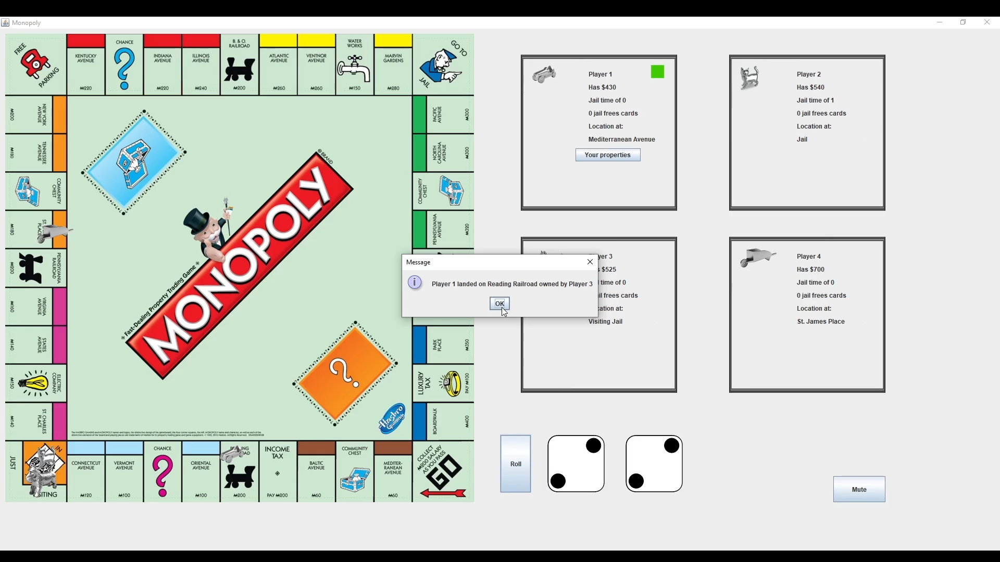

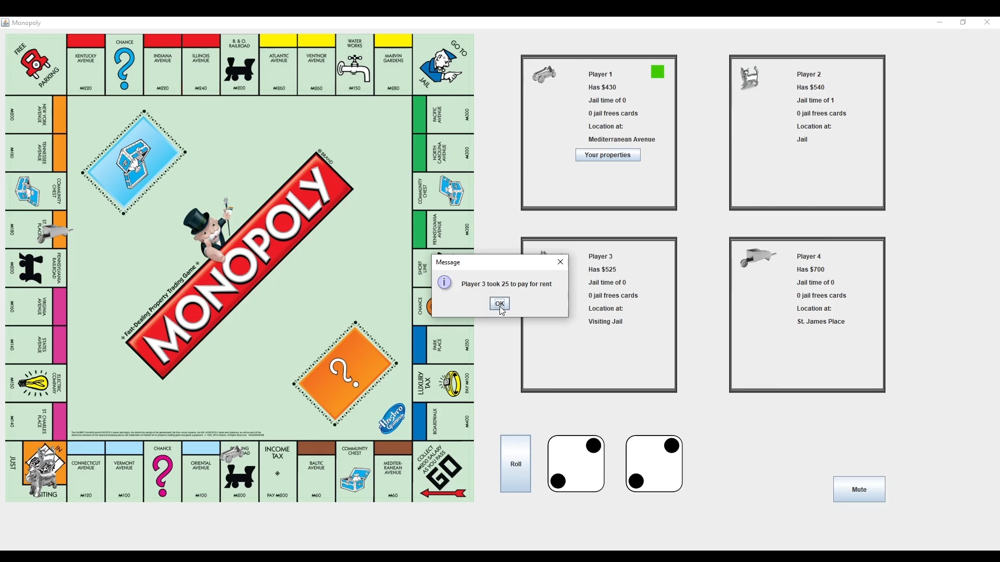

## I learned how to:
- Collaborate on a coding project (this was my first coding group project)
- Override and paint onto the JFrame directly
- Parse and organize the data from text files 
- Store data for the information related to the properties
- Display images onto the main window and sub-windows
- Implement Java lambda expression
- Use recursion to allow the next player who isn't out to play
